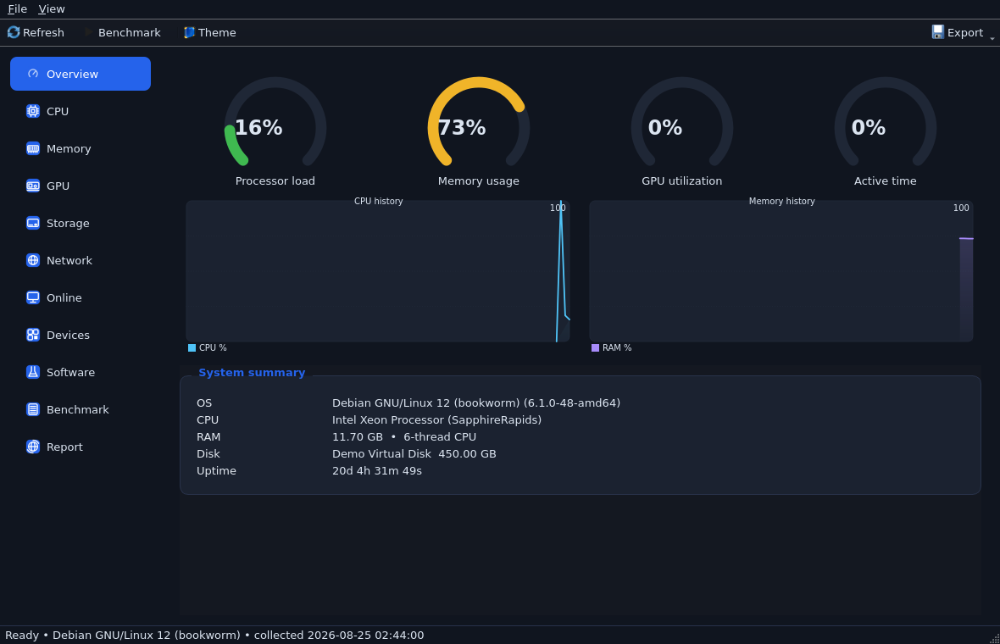

# KradDeviceInfo

**krad.device.info** — Windows uchun to'liq apparat va dasturiy ta'minot
inventarizatsiya vositasi. C++17 + Qt (Widgets/Concurrent/Network) da yozilgan,
tashqi kutubxonalarsiz (faqat WinAPI / WMI / SMBIOS / PDH / DXGI).



## Imkoniyatlar

| Modul | Tafsilotlar |
|-------|-------------|
| **Overview** | Real-time gauge'lar (CPU/RAM/GPU/Disk), tarix grafiklari, tezkor ma'lumot |
| **CPU** | Brend, yadro soni, keshlar (L1/L2/L3), ko'rsatmalar (AVX-512...), soatlar, hipervizor, kod nomi |
| **Memory** | Modul darajasida SPD (ishlab chiqaruvchi, part-number, MT/s), slotlar, ECC |
| **GPU** | DXGI + SetupAPI: VRAM, vendor/device id, drayver versiya/sana, video rejim |
| **Storage** | NVMe/SATA/USB, SSD/HDD, sog'liq (health), firmware, TRIM, partitsiyalar, volume'lar |
| **Network** | Adapterlar, MAC, IPv4/6, gateway, DNS, DHCP, tezlik, trafik + live throughput grafigi |
| **Online** | Cloudflare speed test, public IP+geo, DNS benchmark, NTP clock drift, update check, report share (dpaste/paste.rs), **LAN web dashboard** (telefon brauzeridan real-time kuzatish, port 8787) |
| **Devices** | Monitorlar (EDID parse), USB qurilmalar, batareya (kishsayish %), audio |
| **BIOS** | SMBIOS raw parser (GetSystemFirmwareTable): UUID, board seriya, boot rejimi, Secure Boot |
| **Software** | O'rnatilgan dasturlar (HKLM/HKCU + Wow64), autostart, xizmatlar |
| **Benchmark** | CPU (1/N-thread), xotira (bandwidth + latency), disk (seq + 4K random IOPS) |
| **Report** | JSON / HTML / TXT / CSV eksport |
| **KradUpdate (C#)** | .NET 8 self-updater: manifest check, SHA256 verify, backup bilan yangilash |

## Tizim talablari (ishga tushirish uchun)

- Windows 7/8/8.1/10/11 x64 yoki Server 2008 R2+
- CPU: SSE4.2 (2011+ protsessorlar)
- Portable ZIP — Qt DLL'lari ichida, boshqa hech nima kerak emas

---

## Qurish (build)

### Talablar

| Dastur | Versiya | Izoh |
|--------|---------|------|
| CMake | 3.16+ | |
| Qt | 5.15.x (mingw81_64 yoki msvc2019_64) | Widgets + Concurrent + Network modullari qtbase tarkibida |
| Kompilyator | MSVC 2019+ **yoki** MinGW-w64 GCC 9+ | MinGW bo'lsa **posix** threads varianti (`x86_64-w64-mingw32-g++-posix` yoki `mingw32-g++` posix build) |

### 1) Windows — MSVC (Visual Studio 2022)

Qt'ni https://www.qt.io/download (open source) orqali o'rnating —
komponenta: **Qt 5.15.2 / MSVC 2019 64-bit**.

```bat
cmake --preset win-msvc
cmake --build build-msvc --config Release
```

Natija: `build-msvc\kraddeviceinfo.exe`

Agar Qt boshqa joyda bo'lsa:
```bat
cmake --preset win-msvc -DCMAKE_PREFIX_PATH=D:\Qt\5.15.2\msvc2019_64
```

### 2) Windows — MinGW-w64

Qt onlayn installer'da **Qt 5.15.2 / MinGW 8.1 64-bit** komponentasini
o'rnating (u MinGW kompilyatorni ham o'zi o'rnatadi:
`C:\Qt\Tools\mingw810_64`).

```bat
cmake --preset win-mingw
cmake --build build-mingw
```

Natija: `build-mingw\kraddeviceinfo.exe`

PATH'ga Qt va MinGW `bin` papkalarini qo'shing yoki:
```bat
set PATH=C:\Qt\Tools\mingw810_64\bin;C:\Qt\5.15.2\mingw81_64\bin;%PATH%
cmake --preset win-mingw
```

Ishga tushirish uchun exe yonida shu DLL'lar bo'lishi kerak
(hech bo'lmasa): `Qt5Core.dll, Qt5Gui.dll, Qt5Widgets.dll,
Qt5Concurrent.dll, Qt5Network.dll, libgcc_s_seh-1.dll,
libstdc++-6.dll, libwinpthread-1.dll` va `platforms\qwindows.dll`.

### 3) Linux — demo build (sinov/CI uchun)

Linux'da ham loyiha to'liq quriladi va ishlaydi (real /proc ma'lumotlari,
GUI to'liq). Windows API o'rniga demo backend ishlatiladi.

```bash
sudo apt install cmake g++ qtbase5-dev qtbase5-dev-tools
cmake --preset linux-demo
cmake --build build-linux
./build-linux/kraddeviceinfo
```

### 4) Linux'dan Windows exe (cross-compile)

```bash
pip install aqtinstall
python3 -m aqt install-qt windows desktop 5.15.2 win64_mingw81 \
  --outputdir /opt/qt-win
sudo apt install g++-mingw-w64-x86-64-posix

cmake -B build-win-gui --toolchain packaging/mingw-win-qt.cmake \
  -DCMAKE_BUILD_TYPE=Release \
  -DKRAD_HOST_MOC=/usr/lib/qt5/bin/moc \
  -DKRAD_HOST_RCC=/usr/lib/qt5/bin/rcc \
  -DKRAD_HOST_LRELEASE=/usr/lib/qt5/bin/lrelease
cmake --build build-win-gui
```

Natija: `build-win-gui/kraddeviceinfo.exe` (Windows x64 GUI).

### 5) C# KradUpdate (.NET 8)

```bash
# .NET SDK 8: https://dotnet.microsoft.com/download
dotnet build  src/csharp/KradUpdate -c Release
dotnet publish src/csharp/KradUpdate -c Release -r win-x64 \
  --self-contained true -p:PublishSingleFile=true -p:PublishTrimmed=true \
  -o dist/KradUpdate-win64
```

Ishlatish:
```
KradUpdate check   https://kraddeviceinfo.pages.dev/version.json 1.0.0
KradUpdate install https://kraddeviceinfo.pages.dev/version.json C:\MyKrad
```

---

## CLI (buyruq qatori)

```bat
kraddeviceinfo --export json -o C:\reports\pc.json
kraddeviceinfo --export html
kraddeviceinfo --bench cpu,memory,disk --duration 10
kraddeviceinfo --monitor --interval 500
kraddeviceinfo --help
```

## Testlar

```bash
# Linux'da online xizmatlar testi (dashboard, speed, dns, ntp):
cmake --preset linux-demo && cmake --build build-linux --target online_test
./build-linux/online_test

# Windows core smoke test:
build\krad_smoke.exe
```

## Packaging

- **Portable ZIP**: `dist/KradDeviceInfo-*-portable/` papkasini zip'lang
- **NSIS installer** (Windows'da): `makensis packaging/installer.nsi`
- **MSI** (Linux'da, msitools): `packaging/installer.wxs` — `wixl -a x64`
  bilan quriladi; File Source'lar relative bo'lishi kerak (msi-src staging)
- **Sayt**: `site/` papkasini Cloudflare Pages'ga upload qiling
  (`./deploy.sh` yoki dashboard orqali) — `version.json` update check uchun

## Arxitektura

```
include/krad/model.h        Qt-free ma'lumot modeli
src/core/                   util, report, benchmark (portable, Qt-free)
src/platform/win32/         Win32/WMI/PDH/SMBIOS/DXGI kollektorlar
src/platform/linux_backend  /proc asosidagi demo backend
src/app/                    main, CLI, eksport, online xizmatlar
src/csharp/KradUpdate       .NET 8 self-updater
src/gui/                    Qt GUI: tema, gauge/chart, 11 sahifa
tests/                      win_smoke, online_test, gui_bench_test
packaging/                  NSIS + WiX (wixl) + cross-compile toolchain
site/                       Cloudflare Pages landing + downloads
```

## Litsenziya

MIT — qarang [LICENSE](LICENSE).
